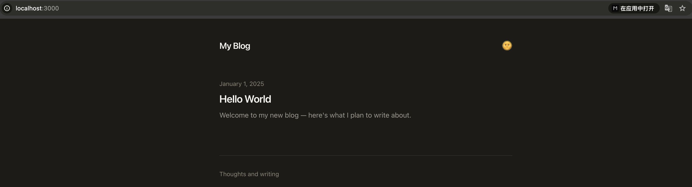

# Blog Poster

A minimal, bilingual blog built with Next.js 15 and Tailwind CSS 4. Fork it, edit one config file, and start writing.

**Live example:** [michaelzuo.vip](https://michaelzuo.vip)

## Quick Start

```bash
git clone https://github.com/MichaelZuo-AI/blog-poster.git my-blog && cd my-blog
npm install
npm run dev     # runs on :3000 with default config
```

Edit `site.config.ts` (auto-created on first run) to set your blog name, description, and tagline.



## Configuration

All site-wide settings live in **`site.config.ts`**:

```typescript
{
  name: "My Blog",              // site title & header
  description: "...",           // meta description
  tagline: "...",               // footer text
  ogImage: "/og-image.png",    // Open Graph image (relative path)
  url: "https://example.com",  // optional — enables full OG URLs
  cloudflareAnalyticsToken: "...",  // optional — omit to disable
}
```

## Features

- **Bilingual posts** — EN/ZH with client-side language toggle
- **Dark mode** — with localStorage persistence
- **Static export** — deploy anywhere (GitHub Pages, Vercel, Cloudflare Pages)
- **Single config file** — one file to customize everything
- **Cloudflare Analytics** — optional, only loads when token is set

## Writing Posts

Posts live in `content/` as markdown files with YAML frontmatter:

```
content/
├── hello-world.md       # English (primary)
└── hello-world.zh.md    # Chinese translation (optional)
```

### Frontmatter format

```yaml
---
title: "Hello World"
date: "2025-01-01"
spoiler: "A short description shown in the post list."
---

Your markdown content here.
```

## Deployment

The included GitHub Actions workflow (`.github/workflows/deploy.yml`) auto-deploys to GitHub Pages on push to `main`. For other platforms, use `npm run build` and deploy the `out/` directory.

## Stack

- **Framework:** Next.js 15 (static export)
- **Styling:** Tailwind CSS 4 + Typography plugin
- **Content:** Markdown with gray-matter + remark
